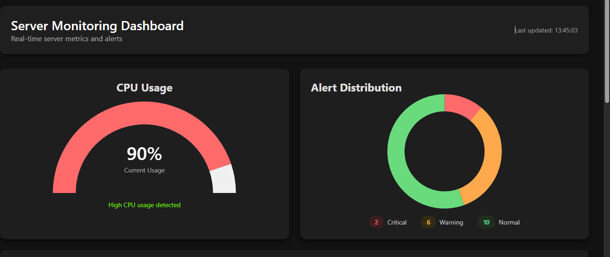
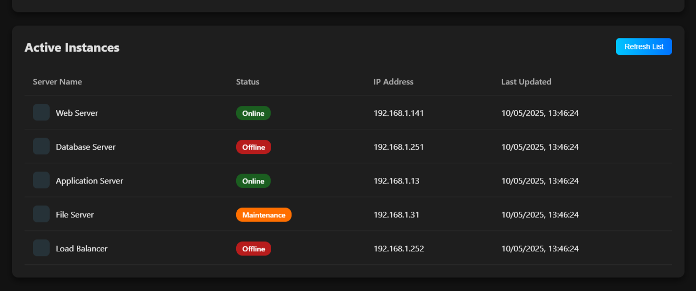

# Server Monitoring Dashboard
A web-based dashboard for monitoring server metrics including CPU, RAM, disk usage, and network traffic.






## Features

- Real-time server metrics monitoring
- Alert system with critical, medium, and low priority alerts
- Server resource usage visualization
- Network traffic monitoring
- Server list and information display

## Setup Instructions

### Backend Setup

1. Create a virtual environment:
```bash
python -m venv venv
source venv/bin/activate  # On Windows: venv\Scripts\activate
```

2. Install dependencies:
```bash
pip install -r requirements.txt
```

3. Run the backend server:
```bash
python backend/app.py
```

### Frontend Setup

1. Navigate to the frontend directory:
```bash
cd frontend
```

2. Install dependencies:
```bash
npm install
```

3. Run the development server:
```bash
npm start
```

The application will be available at:
- Frontend: http://localhost:3000
- Backend API: http://localhost:5000
